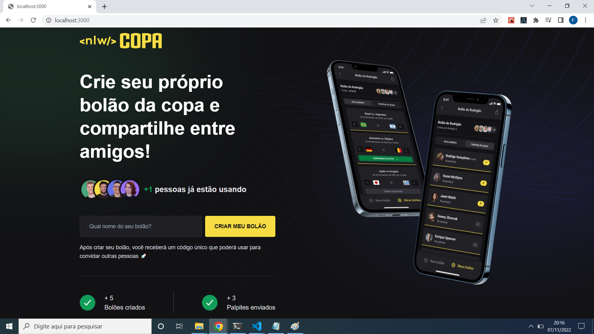

# NLW COPA - Frontend

<h1 align="center">
    
</h1>

## :notebook_with_decorative_cover: 	Descrição do Projeto
O Projeto foi desenvovlido no NLW Copa, evento disponibilizado pela [Rocketseat](https://lp.rocketseat.com.br/nlw) na trilha Ignite, nesse projeto desenvolvemos uma aplicação completa, [frontend](https://github.com/felippepg/nlw_copa_frontend), [backend](https://github.com/felippepg/nlw_copa_backend) e [mobile](https://github.com/felippepg/nlw_copa_mobile) e autenticação com o Google
Esse repositório diz respeito ao Frontend, o mesmo foi construido em [Nextjs]().com Typescript e Tailwindcss para a estilização da página.
Na parte web do projeto é possivel criar um bolão de apostas, onde essas informações são salvas no backend, porem não foi implementado a autenticação no frontend (somente no mobile).
Para a aplicação funcionar com todas as funcionalidades descritas acima é necesssário ter o [backend](https://github.com/felippepg/nlw_copa_backend) configurado

### :pushpin:	Home

<h1 align="center">
    
</h1>

## 🛠 Tecnologias

As seguintes tecnologias foram usadas na construção da API:

- [NODE](https://nodejs.org/en/)
- [REACT](https://pt-br.reactjs.org/)
- [TAILWINDCSS](https://tailwindcss.com/)
- [NEXTJS](https://nextjs.org/)

## Features

- [x] Criação de bolões